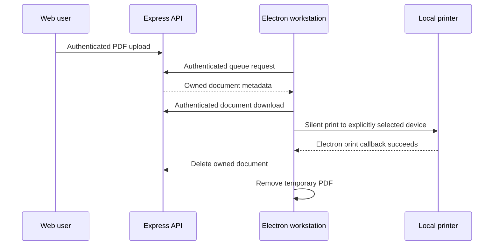
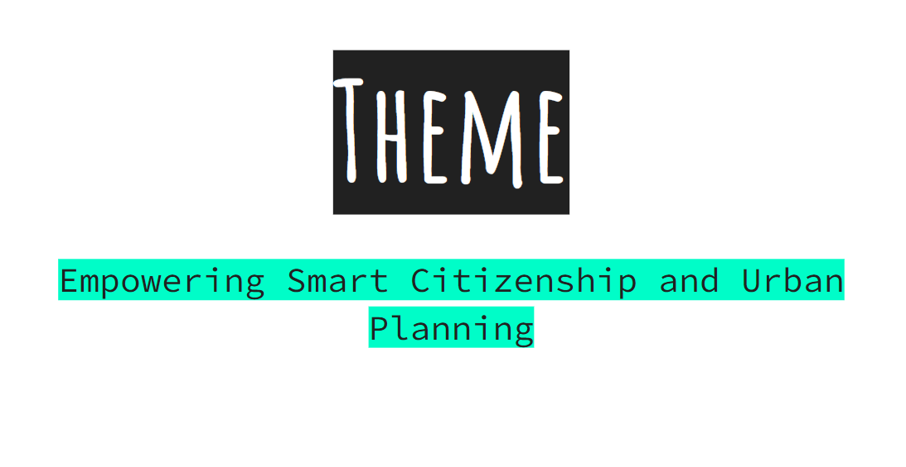
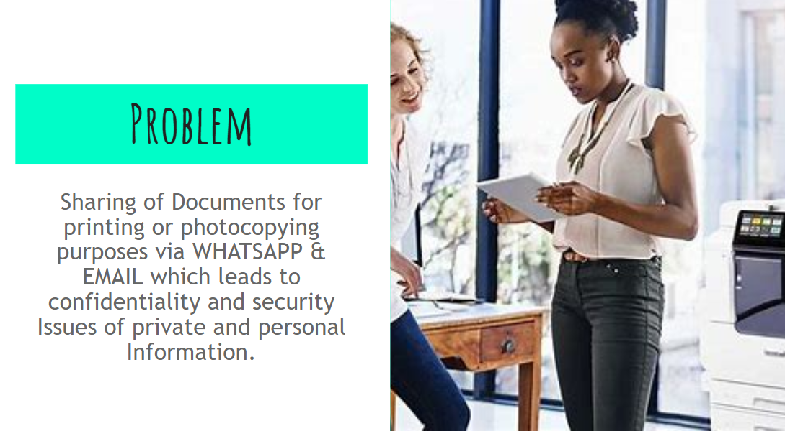
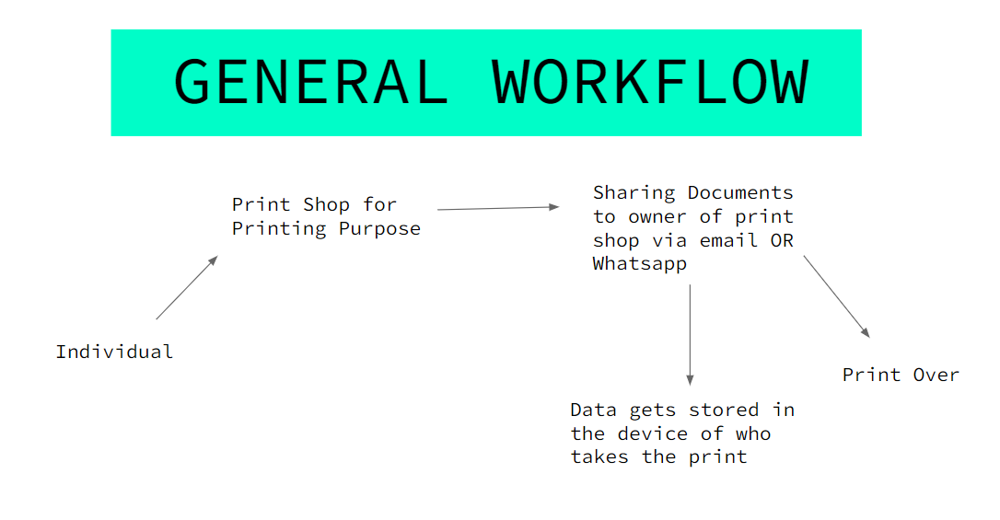
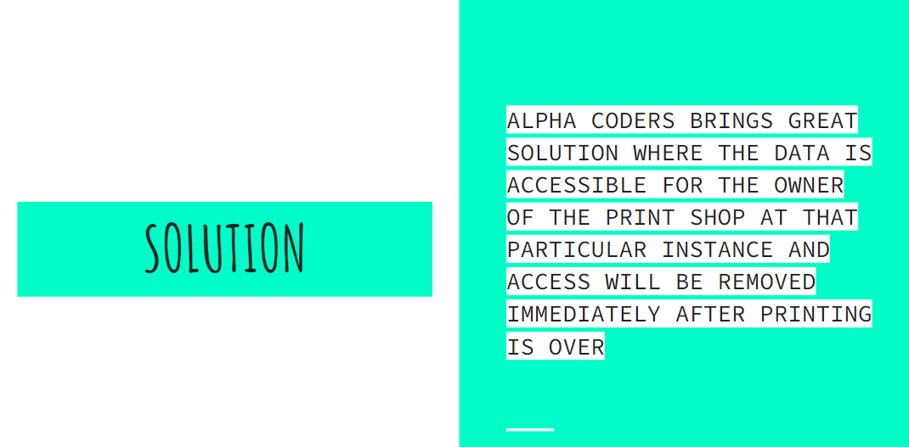

<div align="center">
  

# Secure Print Research Prototype

**An authenticated web, API, and Electron experiment for short-lived PDF handoff to a local print workstation.**

[Workflow](#workflow) · [Quick start](#quick-start) · [Security](#implemented-safety-baseline) · [Limitations](#security-and-privacy-limitations)

</div>

> [!CAUTION]
> This is a research prototype, not a secure document-delivery product. Use only synthetic PDFs in an isolated local environment. A successful Electron print callback confirms that the operating system accepted the request; it does not prove physical output, deletion from printer memory, or forensic erasure.

## What is it?

Secure Print explores a document workflow in which an authenticated user uploads PDFs, a workstation signed into the same account sees that private queue, and the workstation requests server deletion only after Electron reports that a selected local printer accepted the job.

The repository keeps the original web interface and screenshots while replacing the earlier phone-number paths, unauthenticated file APIs, plaintext passwords, hard-coded identities, and unrestricted Electron renderer with a bounded local design.

## Workflow



The API stores random server filenames and exposes documents by MongoDB ID. Both metadata and content routes enforce JWT ownership.

## Interface snapshots

| Web experience | Prototype flow |
| --- | --- |
|  |  |
|  |  |

Screenshots show the original hackathon interface and may differ from the hardened flow.

## Quick start

Requirements: Node.js 20+, npm, a local MongoDB instance, and a disposable test PDF. Electron additionally requires a local desktop session and printer.

### 1. API

```bash
cd BackApp
cp .env.example .env
npm ci
npm start
```

Replace the example JWT secret before starting. The API binds to `127.0.0.1:5000` by default.

### 2. Web client

```bash
cd secure_print
cp .env.example .env
npm ci
npm start
```

Create an account, sign in, and upload one to five PDFs. The client keeps its one-hour token in `sessionStorage`, so closing the tab ends the browser session.

### 3. Desktop client

```bash
cd InnoApp
npm ci
npm start
```

Set `SECURE_PRINT_API_URL` only if the loopback API uses a different port. The desktop client rejects non-loopback API URLs in this prototype.

## Repository map

| Directory | Purpose |
| --- | --- |
| `BackApp/` | Express API, JWT authentication, MongoDB metadata, bounded PDF storage |
| `secure_print/` | React registration, login, profile, and upload interface |
| `InnoApp/` | Context-isolated Electron login, queue, printer selection, and print lifecycle |
| `py-app/` | Earlier standalone printing experiments; not part of the supported flow |
| `images/` | Historical interface captures |

## Implemented safety baseline

- bcrypt password hashing and generic login failures
- required 32-character JWT secret, issuer/audience checks, and one-hour expiry
- authentication and owner scoping on upload, list, content, and delete routes
- PDF MIME and magic-byte validation, configurable size limits, five-file maximum, and random storage names
- loopback API binding, explicit browser-origin allowlist, Helmet headers, JSON limits, and request throttling
- Electron context isolation, sandboxing, disabled Node integration, denied permissions and popups, and a minimal preload bridge
- selected-printer validation and server deletion only after the Electron print callback succeeds
- temporary desktop file removal in a `finally` block even when printing fails

## Security and privacy limitations

- Files are encrypted neither at rest nor end to end.
- JWTs in the React prototype remain accessible to same-origin JavaScript; a production design should use a hardened session architecture.
- Deleting a path does not guarantee secure erasure on SSDs, filesystems, backups, MongoDB journals, printer spools, or printer storage.
- Electron's callback reports submission success, not completed physical printing.
- There is no print-shop delegation model: the browser and workstation currently use the same account.
- No malware scanning, PDF sanitization, audit trail, retention worker, TLS, key rotation, account recovery, or independent security review is included.
- The Python experiments and historical screenshots are archival and do not inherit the Node/Electron controls.
- There is no license file; source availability does not grant permission to reuse the code.

Do not use this repository for personal, regulated, confidential, or otherwise sensitive documents.
