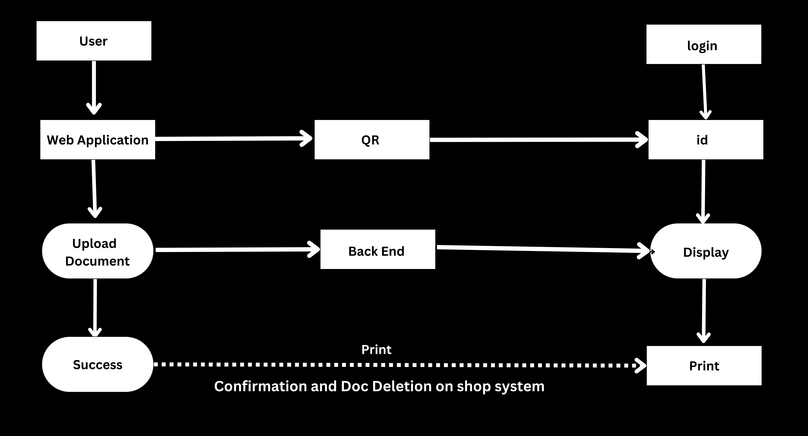
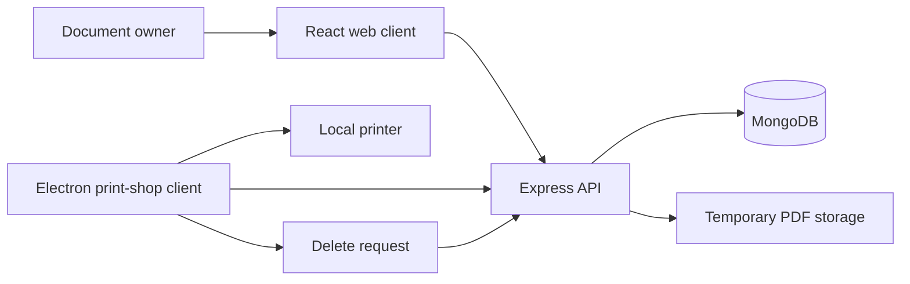

<div align="center">
  
  <h1>Secure Print Prototype</h1>
  <p>A web, API, and desktop proof of concept for transferring a document to a print-shop workstation and deleting the server copy after a print request.</p>
</div>

> [!CAUTION]
> **Do not deploy or use this prototype for sensitive documents.** The current implementation does not provide the security guarantees implied by the project name. It contains hard-coded secrets and identifiers, plaintext password handling, unauthenticated file routes, unsafe Electron settings, and deletion logic that is not tied to confirmed printer completion.

## Intended workflow





The code explores this sequence:

1. A user registers and uploads a PDF through the web client.
2. The Express service records metadata and stores the uploaded file.
3. A desktop Electron client retrieves a document and sends it to a configured printer.
4. The client requests deletion after initiating the print operation.

Step 4 is an intent, not proof of secure deletion or successful physical printing.

## Interface snapshots

| Web experience | Print flow |
| --- | --- |
|  |  |
|  |  |

An additional project snapshot is available at [`images/image-4.png`](images/image-4.png).

## Repository layout

```text
secure_print/   React web client
BackApp/        Express, MongoDB, upload, and document API
InnoApp/        Electron print-shop client
python/         printing experiments
images/         captured project screens
```

## Local exploration only

Requirements: Node.js/npm, a local MongoDB instance, and an isolated test machine with no sensitive documents.

```bash
# API
cd BackApp
npm install
npm start

# Web client — separate terminal
cd secure_print
npm install
npm start

# Desktop client — separate terminal
cd InnoApp
npm install
npm start
```

The components contain hard-coded local URLs, a phone number, and a printer choice. Review the source and replace those values before even a local smoke test.

## Security gaps to resolve

- Hash passwords and migrate existing plaintext data.
- Replace the literal JWT secret and move all secrets to environment-backed configuration.
- Require authorization and ownership checks on every upload, download, list, and delete route.
- Validate file type, size, name, storage path, and document identity; prevent path traversal and identifier collisions.
- Enable Electron context isolation, disable Node integration in renderer content, and use a minimal preload bridge.
- Confirm print-job completion before deletion and define what deletion means across disk, database, logs, backups, and caches.
- Add TLS, audit logging without document leakage, retention controls, threat modeling, tests, and independent security review.

## Status

This repository is retained locally for security and architecture review. It is a hackathon-style proof of concept and must not be described as secure or production-ready until the gaps above are demonstrably fixed.
